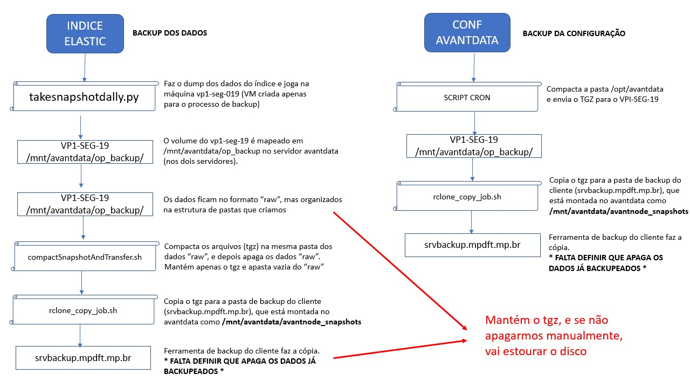

# Backup
Nesta documentação constam as informações acerca do processo (scripts, fluxogramas, configurações, etc) do backup dos dados hospedados no AvantData.

  <a href="#fluxograma">Fluxograma</a> •
  <a href="#configurações">Configurações</a> •
  <a href="#scripts">Scripts</a> •

## Fluxograma

O fluxograma de execução do backup no ambiente pode ser observada na figura abaixa, onde podemos observar os scripts executados, suas funcionalidades gerais e os servidores que acessam. 

## Configurações

Nesta seção falaremos sobre as configurações prévias necessárias para o funcionamento do processo de backup.

### Configurações no AvantData

Placeholder (Configurações da cron feitas pela interface do AvantData)

### Montagem de volumes via NFS

Durante a confecção deste documento, foi constatado nos sistemas que hospedam o AvantData que as configurações existentes para montagem dos volumes via NFS são feitas através dos comandos:

* /dev/mapper/centos-mnt_avantdata on /mnt/avantdata type xfs (rw,relatime,attr2,inode64,noquota)
* 10.34.229.206:/var/temp/estatisticas_otrs on /mnt/avantdata/otrs_estatisticas type nfs4 (rw,relatime,vers=4.1,rsize=1048576,wsize=1048576,namlen=255,hard,proto=tcp,timeo=600,retrans=2,sec=sys,clientaddr=10.34.219.11,local_lock=none,addr=10.34.229.206)
* vp1-seg-019:/bkp_op_avandata on /mnt/avantdata/backup_op type nfs (rw,relatime,vers=3,rsize=32768,wsize=32768,namlen=255,hard,proto=tcp,timeo=600,retrans=2,sec=sys,mountaddr=10.34.228.7,mountvers=3,mountport=2049,mountproto=udp,local_lock=none,addr=10.34.228.7)
* vp1-seg-019:/bkp_op_avandata on /mnt/avantdata/op_backup type nfs (rw,relatime,vers=3,rsize=32768,wsize=32768,namlen=255,hard,proto=tcp,timeo=600,retrans=2,sec=sys,mountaddr=10.34.228.7,mountvers=3,mountport=2049,mountproto=udp,local_lock=none,addr=10.34.228.7)
* //srvbackup.mpdft.mp.br/setseg/AvantDataSnapshots on /mnt/avantdata/avantnode_snapshots type cifs (rw,relatime,vers=3.0,cache=strict,username=ss_backup_avantdata,domain=mpdft.mp.br,uid=1000,forceuid,gid=1000,forcegid,addr=10.34.213.18,file_mode=0755,dir_mode=0755,soft,nounix,mapposix,rsize=1048576,wsize=1048576,echo_interval=60,actimeo=1)

Para maiores detalhes sobre os parâmetros usados nesses comandos, favor analisar o documento [PDF](Doc_backup_info.pdf).

### Permissões de acesso aos servidores NFS

* **VP1-SEG-019:** As permissões de leitura/escrita para a pasta vp1-seg-019:/bkp_op_avantdata são configuradas a partir de endereçamento, ou seja, caso novas máquinas sejam adicionadas ao cluster do AvantData é NECESSÁRIO adicionar as devidas permissões aos novos IPs para que essas entidades tenham acesso a pasta no VP1-SEG-019. Servidor sob nossa responsabilidade (enquanto não formalizar o acesso requisitar auxílio do time do MP para eventuais mudanças).

* **srvbackup.mpdft.mp.br:** As permissões de leitura/escrita para a pasta //srvbackup.mpdft.mp.br/setseg/AvantDataSnapshots são definidas acesso de uma credencial válida, no nosso caso usando o usuário ss_backup_avantdata e a senha associada a essa conta (Requisitar ao time essas credencial). Esse usuário tem somente permissão de montagem nesse servidor, não podemos ter acesso.

## Scripts

O script principal para o processo de backup é o programa em Python takeSnapshotDally.py que, basicamente (para mais detalhes checar o script), se conecta por dentro de uma das caixas do AvantData ao endereço interno de uma instância do ElasticSearch (10.20.30.1) com intuito de coletar os dados associados aos índices mapeados no script. A partir de funções da biblioteca do ElasticSearch para o Python, são criados os snapshots localmente na pasta /mnt/avantdata/op_backup, que, como está descrito na seção Configurações, está montada via NFS em vp1-seg-019:/bkp_op_avantdata.

Após finalizar a criação dos índices na máquina intermediária vp1-seg-019, é execuado um shell script nomeado rclone_copy_job.sh que compacta os dados dos índices em formato tar.gz e, usando o comando rclone, os copia para a pasta local /mnt/avantdata/avantnode_snapshots, que por sua vez está mapeada no servidor final de backup do projeto srvbackup.mpdft.mp.br/setseg/AvantDataSnapshots.

Para maiores detalhes recomenda-se a leitura dos códigos hospedados no repositório NIVA-TI.