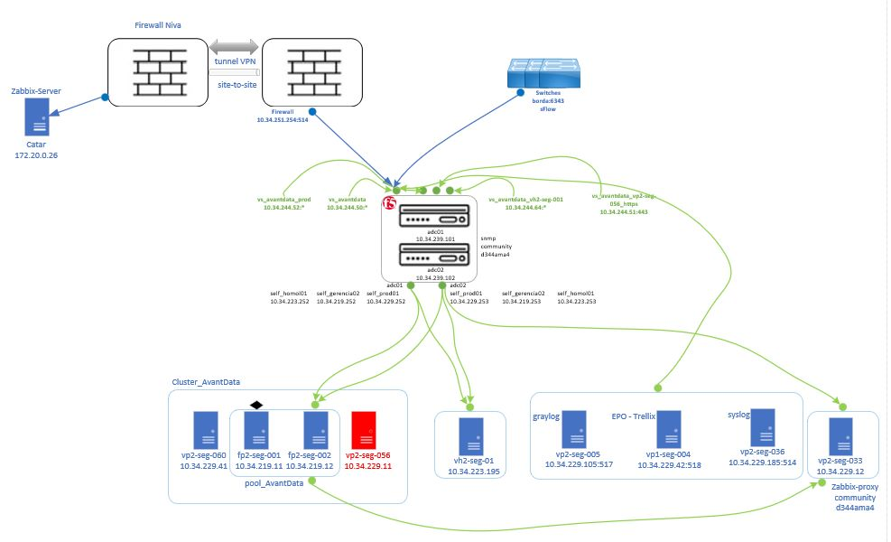

# Topologia lógica
Nesta documentação constam as informações acerca da topologia lógica do ambiente do projeto, como por exemplo: visualização da topologia, nomeclatura de máquinas do ambiente, explicação de entidades e comentários gerais.

  <a href="#topologia">Topologia</a> •
  <a href="#nomenclatura">Nomenclatura das máquinas</a> •
  <a href="#explicação">Explicação das entidades</a> •
  <a href="#adicionais">Adicionais</a> •

## Topologia

A topologia pode ser observada no draft inicial da figura abaixo. Nela podemos observar a existência de diversas entidades que terão suas funcionalidades brevemente descritas neste documento. (Necessário adicionar máquinas do NDR no Cluster AvantData).

## Nomenclatura

A nomenclatura dos sistemas no ambiente do cliente podem ser mapeadas a partir de uma combinação de caracters divididos em:

* **Tipo** - v (virtual), f (físico), n (notebook) e m (estação de trabalho).
* **Objetivo** - h (homologação) e p (produção).
* **Sistema operacional** - 1 (Windows) e 2 (Linux).
* **Departamento** - seg (segurança), inf (infra), dev (desenvolvimento), etc.
* **Número da máquina** - Autoexplicativo.

Exemplo de nomenclatura:
* vh2-seg-01 - Servidor virtual (v) de homologação (h) que está executando um sistema Linux e pertencete ao deparamento de segurança (seg) e tem numeração 01.

## Explicação

### Entidades relacionadas ao AvantData

* **vp2-seg-060** (10.34.229.41):
    * AvantFS - Realiza a replicação das atividades nos nós (conjunto de containers) do cluster AvantData

* **pool_AvantData (cluster)**:

    * **fp2-seg-001 (10.34.219.11)**
        * Contém os containers das aplicações 
            * AvantNode - ElasticSearch
            * AvantAPI  - API do AvantData
            * AvantCore - ?
            * AvantCache - ?
            * AvantBase - ?
            * AvantBallance - Balanceador de carga (??)
            * AvantFS - Conteiner de comunicação com AvantFS (seg-060)

    * **fp2-seg-002 (10.34.219.12)**
        * Similar ao seg-001

    * **fp2-seg-003 (IP)**
        * NDR (aparentemente não funcional)

    * **fp2-seg-004 (IP)**
        * NDR (aparentemente não funcional) (cluster com 003)

    * **vp2-seg-056**
        * Desativada
        * Antiga máquina que hospedava o AvantData virtual (sem appliance dedicado)

### Outros sistemas relevantes

* **vh2-seg-01 (10.34.223.195)**
    * Máquina de homologação AvantData
    * Desligada recentemente
    * Desativada por escaneamento interno de vuln do MP
    * Necessidade de realizar atualização do sistema (AvantSec)

* **vp1-seg-19 (IP)**
    * Servidor do MP que armazena os backups da solução

* **vp2-seg-033 (10.34.229.12)**
    * Máquina do Zabbix (4.4)
    * Manutenção nossa responsabilidade
    * Recebe dos agentes via SNMPv2
    * Monitoramento do ambiente cliente e AvantData
    * Agentes passivos
    *  Atua como proxy e envia os dados recebidos por polling para o Zabbix-Server (172.20.0.6) no ambiente da Niva (Nome: Rússia)
        * Problema: incompatibildiade na versão do vh2-seg-01 e Zabbix-Server (Futuramente atualizar no MP)

* **adc01 (10.34.239.101) e adc02 (10.34.239.102)**
    * Balanceadores de carga F5
    * Enviam os logs para o VS (VirtualServer) que envia para o AvantData
        * VS atua na borda entre o F5 e um servidor externo realizando análises de segurança nos dados enviados
        * Após análise encaminha 
        * Entidades vs_* recebem os logs para análise de todos os dados recebidos e os enviam a entidade destino (descrita no próprio nome do VS)
        * self_* mapeiam as interfaces de saída do F5
        * (IMPORTANTE) F5AFM não passa pelo VS, direto para caixa ativa do AvantData
        * (IMPORTANTE) Nos switches estão configurados encaminhamentos de flows para o vs_avantdata_prod (10.34.244.52), anteriormente associado vp2-seg-056. 
            * (IMPORTANTE) Essa encaminhamento deveria estar desativado?

* **vp2-seg-005 (graylog) (10.34.229.105:517)**
    * Centralizador de logs do Windows, Apache, dentre outros
    * Enviava diversos tipos de logs para o AvantData
    * Ainda envia para o AvantData ?? *Perguntar ao Mike*
    * (IMPORTANTE) Checar índice e se envia

* **vp1-seg-004 (EPO - Trellix) (10.34.229.42:518)**
    * Antivírus
    * EDR

* **vp2-seg-036 (syslog) (10.34.229.185:514)**
    * Centralizador de diversos tipos de log
    * Envia diversos tipos de dados para o AvantData
    * (IMPORTANTE) Checar para qual índice

## Adicionais

* AvantAgent deveriam estar em todos os sistemas e servidores do ambiente. Atuam como uma agente do antivírus. Como se fosse filebeats.
    * Coletar diversos tipos de losgs no Windows e Linux (rede, comandos, dentre outros)
    * Pode executar comandos diretamente no sistema em que o AvantAgent está em execução

* DNS está instalado direto no Domain Controller, enviando dados via Filebeats.
